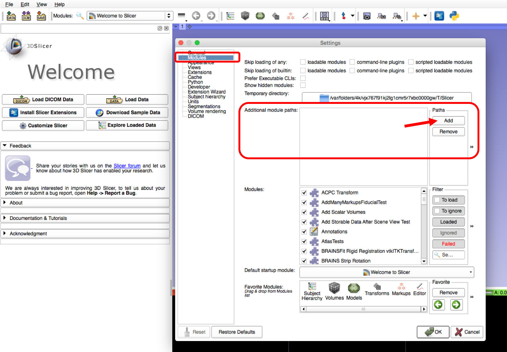
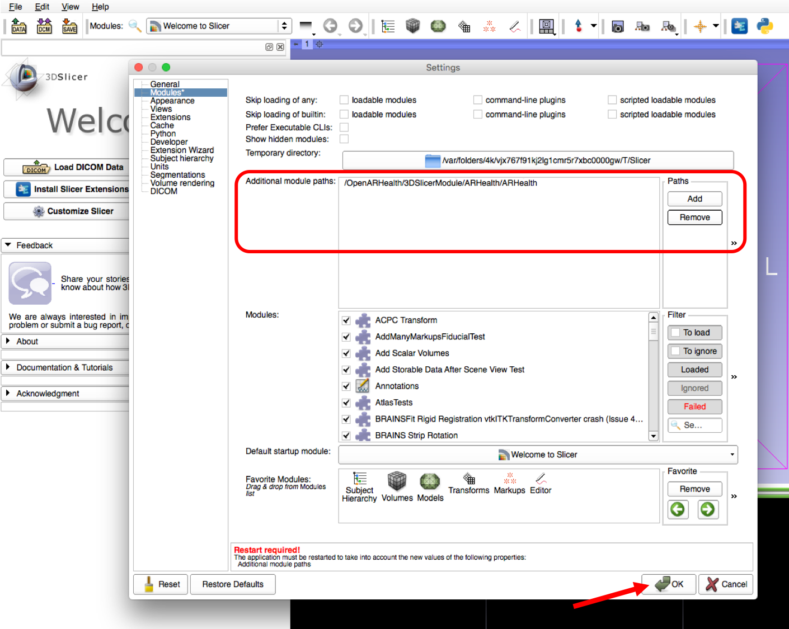
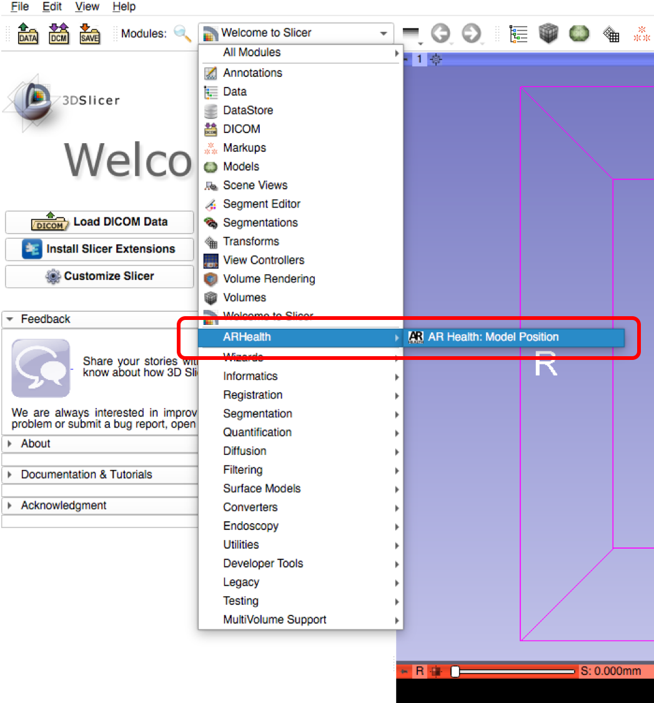

# OpenARHealth

## How To Add "ARHealth: Model Position" Moudule in 3D Slicer

1. Open 3D Slicer software program.

2. Go under Edit > Application Settings.

3. In the Setting emerging window go to 'Modules' section.

4. Under 'Additional moudle paths' click on the 'Add' button.

5. Choose the Folder: "OpenARHealth/3DSlicerModule/ARHealth/ARHealth"

6. Click the 'OK' button and restart 3D Slicer.

7. Now the "ARHealth: Model Position" Module should appear between all modules from 3D Slicer

